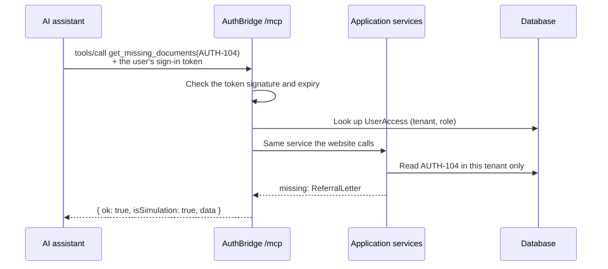
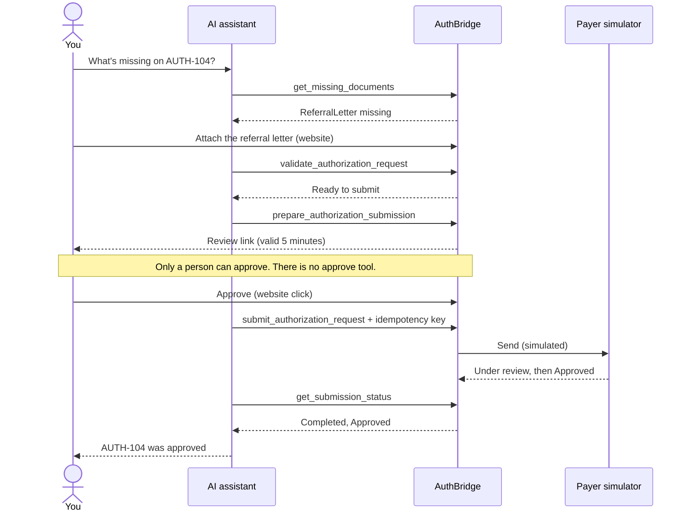
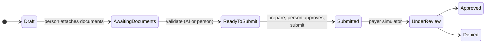
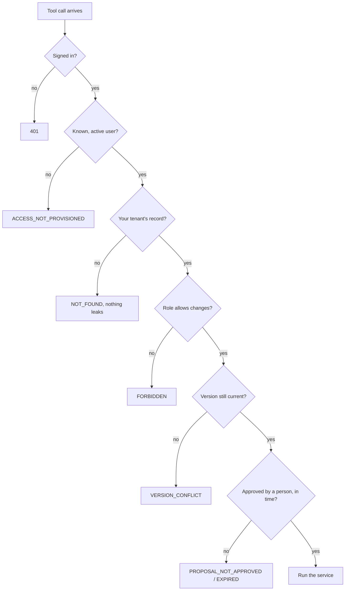
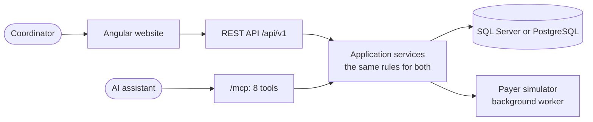

# How the AuthBridge MCP works (simple English)

## The short version

AuthBridge lets an AI assistant help with **prior authorization**: asking an insurance company
("payer") to approve a treatment before it happens.

The AI can **look things up and prepare the work**. A **person must approve** before anything
is sent. Everything is a demo: the patients, the documents and the insurance company are all
fake.

## What is MCP?

MCP (Model Context Protocol) is a standard way for an AI assistant to use tools.

Think of it like this:

- The **AI assistant** is a helper who can read and write.
- An **MCP server** is a toolbox the helper is allowed to open.
- Each **tool** does one clear job, like "check which documents are missing".

The AI does not get the database, passwords or the whole computer. It only gets the tools
in the toolbox.

## What kind of MCP server is AuthBridge?

It is a **custom MCP server**: we built it ourselves, and it talks to our own database.

It can run in two ways:

| Way | Where it runs | Who uses it |
| --- | --- | --- |
| **Local** | On your own laptop (through "stdio") | A developer testing on their machine |
| **Remote** | On a server on the internet, at `/mcp` | An AI app, once it has a user's sign-in |

Both ways use **the same eight tools** and **the same rules**.

## The eight tools

| Tool | What it does in plain words | Does it change anything? |
| --- | --- | --- |
| `get_authorization_status` | "What is the status of AUTH-104?" | No |
| `get_missing_documents` | "Which documents are still missing?" | No |
| `get_authorization_history` | "What has happened to this request so far?" | No |
| `get_required_documents` | "Which documents does this insurer need for this service?" | No |
| `validate_authorization_request` | "Check the request against the rules." | Yes, it updates the status |
| `prepare_authorization_submission` | "Get it ready to send, and give me a review link." | Yes, it creates a proposal |
| `submit_authorization_request` | "Send it now." This works **only after a person approved it.** | Yes |
| `get_submission_status` | "Has the insurer decided yet?" | No |

**There is no "approve" tool.** The AI can never approve. That is on purpose.

## What happens in one tool call



The tenant and role come from the server's own lookup, never from what the AI typed.

## One request, step by step

Example: request **AUTH-104** needs an MRI, but a referral letter is missing.

1. **You ask the AI:** "What is missing on AUTH-104?"
   The AI uses `get_missing_documents`. Answer: the referral letter.
2. **You attach the document** in the AuthBridge website. (The AI cannot attach documents.)
3. **You ask the AI:** "Validate AUTH-104."
   The AI uses `validate_authorization_request`. The status becomes **Ready to Submit**.
4. **You ask the AI:** "Prepare it for submission."
   The AI uses `prepare_authorization_submission` and gives you a **review link**.
   The link works for **5 minutes**.
5. **You open the link and approve.** You read the summary, tick three boxes and click
   **Approve Submission**. This step is only for a person.
6. **You ask the AI:** "Submit it."
   The AI uses `submit_authorization_request`. It is sent to the **pretend insurer**.
7. **You ask the AI:** "Is it decided?"
   The AI uses `get_submission_status`. After a few seconds the answer is **Approved**.



## The life of a request



## How it stays safe

- **You must sign in.** The server checks who you are on every request.
- **You only see your own team's data.** Tenant A cannot see Tenant B. To someone from
  another team, the request looks like it does not exist.
- **Roles matter.** A "Viewer" can only read. A "Coordinator" can make changes.
- **A person approves, not the AI.** Approval is a click on the website, and it expires
  after 5 minutes.
- **No double sending.** Each submission has an "idempotency key", a unique ticket number.
  If the same ticket is sent twice, you get the first result back. Nothing is sent twice.
- **No stale approvals.** If someone changes the request after it was prepared, the old
  approval stops working and a new one is needed.
- **Every answer says it is a simulation.** Tool results include `isSimulation: true`.



## How the pieces fit together



The website and the AI use **the same server and the same rules**. The AI just uses tools
instead of buttons.

## Try it yourself (developers)

```powershell
# in AuthBridgeWebApi
./scripts/setup-local.ps1          # create the demo data
./scripts/smoke-stdio.ps1          # the local MCP: lists the 8 tools, reads AUTH-104
dotnet run --project src/AuthBridge.Api --launch-profile http
./scripts/smoke-http.ps1           # the remote-style MCP at http://localhost:5243/mcp
```

For the technical details, see [TOOL_CONTRACTS.md](TOOL_CONTRACTS.md) and
[ARCHITECTURE.md](ARCHITECTURE.md).

## What is not done yet

- AI apps like Claude or ChatGPT cannot yet connect by themselves with a login screen.
  Today they need a sign-in token supplied to them. The remote MCP runs on Render at `/mcp`
  and accepts the same demo tokens as the website.
